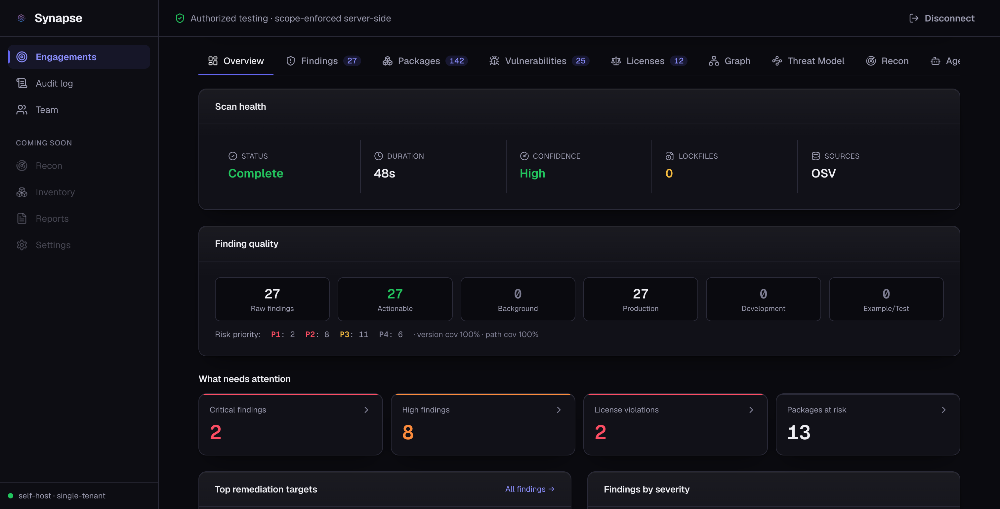

<div align="center">


### Verify Everything. Trust Nothing.

**A governed control plane for software composition analysis, recon, evidence, and reporting.**

Turn a fragmented, manual security process into a controlled, auditable workflow, with
server-side scope enforcement, hardened tool execution, tamper-evident evidence, and
deterministic reports.

[](LICENSE)
[](go.mod)
[](https://synapse.kkloudtarus.net/)
[](https://github.com/KKloudTarus/synapse-ce/actions/workflows/ci.yml)
[](https://goreportcard.com/report/github.com/KKloudTarus/synapse-ce)

[Landing page](https://synapse.kkloudtarus.net/) · [Documentation](docs/guide/README.md) · [Quickstart](#quickstart) · [Features](#features) · [Configuration](docs/guide/configuration.md)

</div>

---

> [!IMPORTANT]
> **Authorized use only.** Synapse is built for authorized security testing, pentest
> engagements, and defensive security work. Every engagement enforces an explicit scope and
> a legal authorization window, server-side, before any tool runs. You are responsible for
> holding written permission to test any target.

<div align="center">

</div>

## Why Synapse

- ✅ **Deterministic first.** Scanning, matching, and reporting are pure, reproducible Go. No model sits in the report path.
- ✅ **Evidence you can trust.** Every artifact is hash-chained into a tamper-evident custody record. A broken chain blocks the report.
- ✅ **One tool, four scanners.** SCA, first-party SAST, secret scanning, and IaC misconfig behind a single gate.
- ✅ **Reachability aware.** A deterministic call graph decides whether a vulnerable symbol is actually reachable from your code.
- ✅ **Detection independent.** Owns its SBOM parsers and advisory matching, and ingests OSV, GHSA, and CSAF.
- ✅ **CI ready.** `synapse-cli` is a single static binary that gates a build and emits SARIF for code scanning.
- ✅ **Safe by construction.** argv-only execution in a Linux sandbox, server-side scope and authorization before any tool runs, secrets never leave the server.

## What is Synapse

Synapse runs the security-assessment lifecycle behind one governed control plane: software
composition analysis, recon, evidence capture, findings, and reporting.

It is deterministic-first. Scanning, matching, license classification, and reporting are
pure, reproducible Go with nothing else in the path. Where automated analysis is offered it
stays strictly bounded: a proposal is only ever proposed, a typed Go state machine validates
and executes, scope and authorization are checked in the execution layer, secrets never leave
the server, every artifact is hash-chained into a tamper-evident custody record, and a human
approves anything intrusive.

## Features

- **SBOM generation** across many ecosystems (npm, PyPI, Maven, Gradle, Go, Cargo, RubyGems,
  Composer, NuGet, Hex, Dart and more), with owned per-ecosystem lockfile parsers.
- **Vulnerability detection** from a live advisory API and an offline database,
  cross-correlated and de-duplicated, plus an owned advisory store that ingests OSV, GHSA and
  CSAF feeds for detection independence.
- **Risk-based prioritization**: findings are ordered by exploitability (known-exploited
  catalog, then exploit-prediction score, then CVSS), never by raw CVSS alone.
- **License compliance**: declared-license resolution, SPDX expression parsing, a curated
  category and risk model, and coordinate recovery for shaded or metadata-less JARs.
- **Reachability**: a deterministic call-graph engine decides whether a vulnerable symbol is
  actually reachable from application code.
- **Tamper-evident evidence**: every artifact is hash-chained. A broken chain blocks the
  report. Audit and evidence logs are append-only.
- **Hardened execution**: tools are shelled out via argv arrays inside a Linux sandbox with
  egress scoping. Scope and the authorization window are enforced before any tool runs.
- **RBAC and tenant isolation** through a single authorization chokepoint.
- **Standards native**: CycloneDX and SPDX with PURL, SARIF, OpenVEX and CSAF, plus KEV and EPSS.
- **Deterministic reports** templated from stored data, with a curated CWE to OWASP, PCI and
  ISO compliance mapping.
- **Bounded AI analysis** (optional): the agent proposes, a distinct verifier or a human
  confirms. No model ever sits in the report path.

See the full walkthrough with screenshots on the [documentation site](https://synapse.kkloudtarus.net/#screens).

## How it compares

Detection is at parity with the popular scanners, and sometimes ahead. On one representative
real-world repository, Synapse reported 261 unique CVEs to Trivy's 239 (235 in common) and
attached a license to 1443 packages to Trivy's 1394. Numbers move with the project, so treat
these as illustrative rather than a benchmark claim.

The lasting difference is what sits around the finding:

| Capability | Synapse | Most scanners |
| --- | --- | --- |
| SCA, license, IaC misconfig, secret scanning | Yes | Yes |
| First-party SAST (source-code rules) | Yes | Usually no |
| Reachability via a call graph | Yes | Rarely |
| Hash-chained, tamper-evident evidence | Yes | No |
| Server-side scope and authorization before a tool runs | Yes | No |
| RBAC, tenant isolation, separation of duties | Yes | No |
| Deterministic, model-free report path | Yes | Varies |

## Quickstart

### Prerequisites

- Go 1.26 (pinned in `go.mod`), Node and pnpm (use pnpm, not npm or yarn).
- Syft (required for any scan) and Grype (optional, adds the offline database). `make tools`
  installs both, pinned and checksum-verified, into `./bin`.
- Docker is optional and is the easiest way to run the full stack.
- The hardened sandbox and live recon need a Linux host. Without them the API still runs
  (SCA, findings, reports); sandboxed execution fails closed rather than running unsandboxed.

### Run the full stack with Docker

```bash
docker compose -f deploy/docker-compose.full.yml up --build
# then open http://localhost:5173
```

### Run natively (development)

```bash
make install                       # Go modules + web deps
make tools                         # syft + grype into ./bin
export PATH="$PWD/bin:$PATH"

export SYNAPSE_API_TOKEN="$(openssl rand -hex 32)"   # required, no anonymous access
make dev                           # API on :8080, dashboard on :5173
```

Open <http://localhost:5173>, paste the token, accept the Acceptable Use Policy. A blank
`SYNAPSE_DB_DSN` runs an in-memory dev store, so nothing is persisted. Migrations are embedded
and applied automatically at startup.

## Command line

`synapse-cli` runs the same pipeline as the server, ideal for CI gating.

```bash
make build
./bin/synapse-cli scan ./path/to/project --fail-on high
```

The exit code is 0 when no finding meets the threshold, non-zero otherwise.

## Binaries

| Binary | Role |
| --- | --- |
| `synapse-api` | HTTP API server, the primary service |
| `synapse-cli` | Run an SCA scan from the command line, CI-friendly |
| `synapse-worker` | Durable job runner for recon and background jobs, lease-based |
| `synapse-callgraph` | Sandboxed call-graph builder for reachability analysis |
| `synapse-mcp` | Read-only, propose-only integration server, never executes |

## Architecture

Clean architecture with a strict, inward-only dependency rule:

```
domain  <-  usecase  <-  adapter / infrastructure
```

All external I/O (database, tools, storage, sandbox) goes through ports, which are interfaces
in `internal/usecase/ports`. `cmd/*` is the composition root, with dependency injection in
`main` and no business logic.

## Configuration

Synapse reads its configuration from the process environment. Copy `.env.example` and adjust.
The only required variable is `SYNAPSE_API_TOKEN`. See the
[configuration reference](docs/guide/configuration.md) for the full list.

Full documentation lives in [`docs/guide/`](docs/guide/README.md): introduction, installation,
quickstart, features, configuration, CLI, architecture, deployment, and the security model.
See [`CHANGELOG.md`](CHANGELOG.md) for what has changed.

## Roadmap

Synapse is under active development. Near-term directions:

- Broader ecosystem coverage: more owned lockfile parsers (Conda, R, Julia, Conan).
- More first-party SAST rules, and additional languages.
- More IaC checks across Terraform, Kubernetes, and CloudFormation.
- Richer SARIF output, including remediation in code-scanning alerts.
- More curated, model-free compliance profiles.
- Reachability for more language ecosystems.
- More CI recipes and integration examples.

Have a request? Open an issue or start a discussion. Issues tagged
[`good first issue`](https://github.com/KKloudTarus/synapse-ce/issues?q=is%3Aissue+is%3Aopen+label%3A%22good+first+issue%22)
and [`help wanted`](https://github.com/KKloudTarus/synapse-ce/issues?q=is%3Aissue+is%3Aopen+label%3A%22help+wanted%22)
are a good place to start.

## Contributors

Synapse was built by its founding team.

| | Contributor | Role |
| --- | --- | --- |
|  | [**nghiadaulau**](https://github.com/nghiadaulau) | Engineer |
|  | [**nnatuan03**](https://github.com/nnatuan03) | Engineer |
|  | [**lethanhsang188**](https://github.com/lethanhsang188) | Engineer |
|  | [**tuu-ngo**](https://github.com/tuu-ngo) | Brand identity designer |

Contributions are welcome. See [CONTRIBUTING.md](CONTRIBUTING.md), the
[Code of Conduct](CODE_OF_CONDUCT.md), and report vulnerabilities per the
[Security Policy](SECURITY.md).

## License

Licensed under the [Apache License 2.0](LICENSE).
