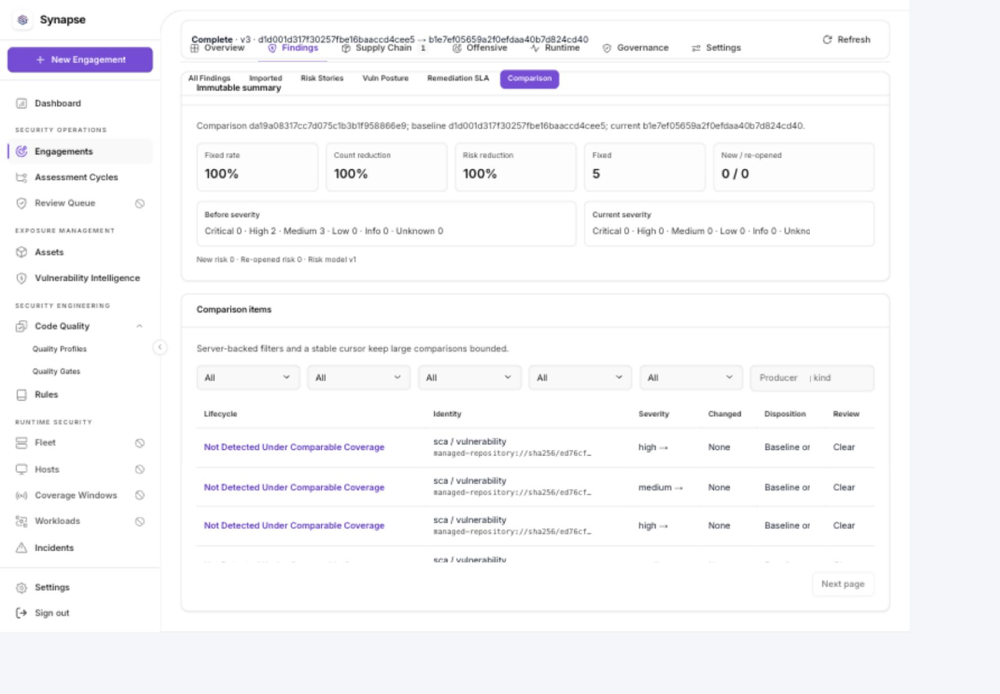
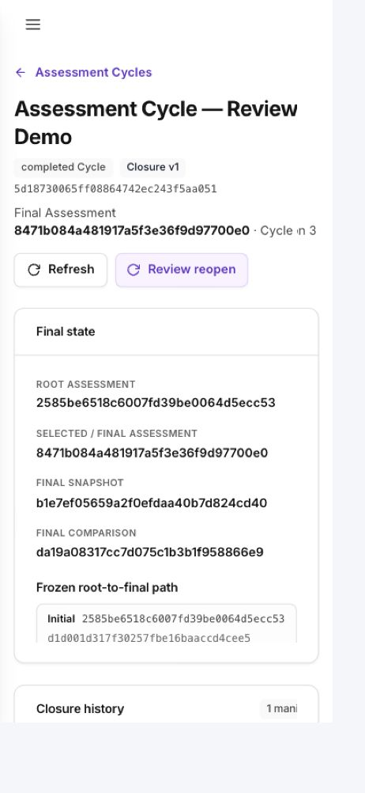

# Assessment Cycle rebuild

Tracking: [epic #694](https://github.com/KKloudTarus/synapse-ce/issues/694).

## Context and source lineage

Base: `main` at `c101de4622fe65f41aa32b68bdc5a1f347fe4933`.
The domain-only foundation from #759 was removed by #840 because no product route
reached it. The full rollout #809 was reverted for review, and the replacement
stack #814–#816 was closed before delivery. Closed issues therefore do not establish
that the capability shipped. This rebuild is explicitly requested by the feature
owner and must deliver reachable end-to-end workflows on current main.

Reusable source contributions are preserved and adapted, not treated as approved:

- ScanRun provenance: VietSory, PR #779, `0340dd14b8d4b171fab0303d938bf3151360f761`.
- Cycle/Snapshot and review fixes: nnatuan03, #814, `847ab02b17da47af484c7ae45bba208907f6acec`.
- Finding lineage: nnatuan03, #815 and local follow-up `73dbf6c4`.
- Comparison/relationship/closure: nnatuan03, #816, `1b1a752de45dd87dca2067898ac87bfea8da244f`.

The existing stash is retained without applying, popping, or modifying it. Selected
lineage correctness fixes from stash `313aa6bc1a85f243845c6a42874bb39e90754282`
were read and adapted individually; its original contents remain recoverable.

## Business contract

An Engagement owns execution, scope, RoE and its own authorization window. A Cycle
owns a single initial root, re-test ancestry, an explicitly selected leaf head and
closure. A Re-test is a new Engagement within that Cycle; a re-scan is another
Snapshot of the same active Engagement. Per-Finding verification remains separate.
No operation requires selecting thousands of Findings individually to create a
Re-test, and comparisons never mutate Finding/SLA workflows.

The tenant and exact Asset/Project boundary are frozen at membership. Hidden
project-analysis contexts are excluded. Branches are supported, but monotonic
re-test numbers are display labels, not ancestry. Reparent/select-head changes use
authorized, versioned preview/commit commands; move/detach/merge/root replacement
are outside the canonical MVP.

Comparisons consume immutable, hashed Snapshots and Observations. Only ordered
same-Assessment Snapshots or ancestor-to-descendant pairs can claim lifecycle
states. Sibling/reverse pairs are neutral diffs. Missing, failed, excluded, legacy
or unknown coverage must never imply Fixed. Matching uncertainty remains reviewable.
DAST and Cloud Posture semantic matchers remain explicitly deferred (#728, #729).

Closure freezes the root-to-selected-head path, comparison inputs, policy and
decision references into a manifest; reports derive solely from that manifest.
Reopening preserves and supersedes the previous closure history.

## Implementation and review gates

- [x] Preserve inward-only domain/use-case/port dependencies and reuse existing UI primitives.
- [x] Wire API, background generation and UI in the production composition roots.
- [x] Use tenant transactions/RLS, composite ownership constraints and atomic audit.
- [x] Keep migrations 0001–0137 untouched; append unique migration versions.
- [x] Cover legacy/default-off behavior, resumable backfill and bounded pagination.
- [x] Resolve prior review findings, including stale ETags, rollback, coverage and authorization.
- [x] Verify initial → scan → finalize → complete → re-test → compare → close → reopen.
- [x] Exercise loading, empty, errors, validation, disabled/success states and keyboard/responsive UI.
- [x] Run lint, typecheck, unit/integration/hostile tests and production builds.
- [x] Verify UI in a browser and attach evidence and measured limitations to the PR.

## Delivery policy

Keep the feature tenant-gated until migration/integrity and rollout checks pass.
Do not upgrade the existing deployed database or enable production tenants as a
side effect of testing this branch. Use isolated validation data and services.
PR checks and remaining risks must distinguish passing results, environment
limitations, pre-existing failures and unverified acceptance criteria.

## Implementation notes

The existing domain/use-case/port layering is retained. The API facade keeps
atomic command receipts (status and serialized application result) for exact
idempotency replay; HTTP authentication, headers, input limits and resource wire
views remain adapter responsibilities. Domain services do not depend on the API
facade. No HTTP package is imported by the lifecycle use cases.

Native observations come from `scan_run_comparison_evidence`, never mutable
Finding projections. Positive-only lanes remain partial. License-only scans
cannot reuse cached vulnerability observations. Manual/offensive Findings enter
a newly finalized Snapshot, not an older default. Risk-only EPSS/KEV metadata is
retained in the immutable run/evidence, but does not define detection coverage.

Each Assessment owns at most one immutable uploaded-source package. Uploaded-source
Re-tests explicitly offer **Use current source** (default) or **Upload new source**
while copying scope. Reuse resolves the selected predecessor, not the Cycle head,
and creates a new child association/version while retaining the original bytes and
upload attribution. New uploads belong only to the child; existing Assessments and
their run history are never relabelled. Each queued scan pins its source metadata,
which is retained in the immutable run manifest. Same-Cycle uploads use the immutable
root Snapshot's source namespace; ambiguous, legacy or unrelated source boundaries
are not automatically joined. Offline API/worker provenance does not claim a live
OSV query.

The source-lifecycle follow-up adds migrations `0159` (source versions and immutable
attribution) and `0160` (job/run source bindings). Metadata is tenant-owned; object
storage is shared S3/MinIO or the persistent `SYNAPSE_ENGAGEMENT_SOURCE_DIR` fallback,
separate from temporary scan workspaces. Intact legacy packages are verified before
promotion. Missing bytes or original metadata are not reconstructed from hashes;
legacy runs remain visibly unavailable, and a new child upload is the recovery path
when the old source is lost. See the
[uploaded-source operations contract](../guide/assessment-lifecycle-operations.md#uploaded-source-lifecycle).

Additional correctness fixes include visible Project association, completed
predecessor eligibility and UI refresh after completion, separately authorized
Re-tests, planned date persistence, completed scan controls, canonical signed
tokens, rollback/after-commit publication, tenant isolation, and bounded history.
Verification attestations apply only to the matching prior Snapshot, never future
observations. Backfill audit failures stop at durable checkpoints.

Closure source history uses PostgreSQL batches of at most 1000 Finding IDs,
with a fail-closed 100,000-row bound per history query. Reference cohorts over 256
entries retain a hash of the complete ordered set, count and earliest expiry.
Reports reconstruct the sources at manifest as-of time; no sampling is used.
Large policy blocker cohorts are likewise counted and hash-bound. Overrideable
High/Critical cohorts require an explicit whole-cohort reason; incomplete
verification cohorts remain non-overrideable.

PostgreSQL closure persistence preserves canonical nil/empty representations and
JSONB metadata key ordering without changing domain hashes. A real repository
round-trip test covers commit, stale conflict, cross-tenant read, report rendering
and unchanged report bytes after reopen.

## Verification — 2026-09-08

- Complete Go suite: `TMPDIR=/private/tmp go test -p 4 ./...` passed after the
  final closure JSONB regression fix; `go build -p 4 ./...` and full `go vet`
  also passed.
- Frontend: 107 files / **616 tests passed**. Typecheck, ESLint and production
  build passed after the final test typing correction. ESLint retains ten existing
  warnings; the existing large-chunk build warning remains.
- Race detector passed for Cycle, Comparison, Relationship, Snapshot, Lineage and
  the memory adapter. All Go commands/packages built.
- PostgreSQL Assessment API/repository, Snapshot, Lineage, ScanRun and migrations
  passed on the isolated validation database: **58.549 seconds**. The new closure
  round-trip/report/reopen test separately passed in **2.438 seconds**.
- All five database administration CLI startup regression tests passed against
  PostgreSQL: privileged roles are rejected before backfill/integrity writes.
- Full Go lint is **not green**: eight findings in unchanged files (two gosec,
  two ineffassign, four unused). Do not describe the entire repository as lint-clean.
  Diff-filtered lint against `c101de4622fe65f41aa32b68bdc5a1f347fe4933`
  passed with **zero new issues**.
- The full PostgreSQL suite is **not green**. A clean exported copy of the exact
  main base reproduced older migration rollback failures at 0085 and the 0136
  JSON-text whitespace assertion (74.215 seconds). Assessment tests use isolated
  databases so immutable history cannot interfere with those older fixtures.
- Helm production rendering/security/data-governance tests and lint with the
  production test values pass. Bare default-values lint correctly refuses an empty
  grant-authority source CIDR list; deployment requires explicit safe configuration.
- Documentation builds successfully. Strict MkDocs retains three existing broken
  ADR-link warnings in `deployment.md`/`security.md`, reproduced unchanged on the
  clean main export; no new documentation warnings were introduced.
- GitHub Actions was disabled in repository settings at delivery. It was not
  enabled or reconfigured by this work; the results above are local validations.
- The mainline response migrations 0138–0143 and ScanRun provenance migration 0144 (ordered by #896) are inherited unchanged. Main also owns advisory alias migration 0145 (#921). Assessment migrations 0146–0160 follow it without renumbering released mainline migrations.
  Released migrations 0001–0137 are unchanged.

### Direct browser verification

The user explicitly approved AUP acceptance for the QA session. Testing used the
isolated API at 18081, UI at 5174 and PostgreSQL at 52510. The API login role is
non-superuser and cannot bypass RLS. Existing production services/data were not
upgraded, reset or reconfigured.

The actual source-upload workflow exercised:

1. Initial upload and native scan (five vulnerability observations).
2. Re-scan in the same Assessment (Snapshot 2, still one Cycle member).
3. Complete the Assessment; scan buttons disabled and completed predecessor
   immediately available without reloading.
4. Create Re-test with a new source ZIP, date-only plan and explicit authorization.
5. Native scan of remediated source (zero vulnerabilities), then comparison:
   five Fixed under complete comparable coverage, no new/reopened/review items.
6. Complete Re-test, preview and commit Cycle closure.
7. Download JSON report; reopen with an audited reason using keyboard navigation.
   Closure v1 becomes superseded while the original manifest/report stay available.
8. Desktop and mobile breakpoint checks, focus traversal, loading/empty/error,
   validation, disabled and success states. The mobile page had no horizontal
   document overflow; temporary viewport overrides were reset.

Demo Cycle: `5d18730065ff08864742ec243f5aa051`.
Report SHA-256:
`fc7a3f87250a6f8c0e513d2702e902a22c078b2df9997abc608f33dbd732f2e5`.

### Measured scale, not a production SLO claim

Opt-in `TestPostgresAssessmentComparisonScale100K` in
`assessment_scale_test.go` seeds 100,000 identities and 200,000 observations across
two Snapshots, generates 100,000 comparison items using the real application
service and PostgreSQL stores, then reads twenty filtered 100-item pages.

- Fixture seed: 7.903s.
- Queue + generation: **42.830s**, of which queue admission was 729.6ms.
- Filtered pages: p50 **50.0ms**, p95 **79.8ms**, max **157.1ms**.
- Closure source collection: **1.546s**, compact reference payload **234 bytes**.
- Complete reference-set resolution: **1.633s**.

These are local measurements, not a statistical generation p95, HTTP-load result,
or the full 50-member / 5-branch / 10-Snapshot-per-member production canary.
The rollout gate still requires the documented target-cardinality 30-minute SLO
and operator approval before enabling production reads/UI.

## Rollout risks and explicitly deferred scope

- Keep tenant feature flags default-off. Follow the migration, dry-run backfill,
  integrity, shadow comparison and canary sequence in the operations guide.
- The full executable production worker correctly refuses macOS without Linux
  amd64/bubblewrap. Browser QA used an opt-in, loopback-only comparison/report
  worker with the real durable claim loop and handlers, registering **no executable
  scan/recon/integration jobs**. Linux sandbox conformance remains a deployment gate.
- Live OSV returned a transport error and a timeout during QA; these exercised the
  error/retry path. The successful deterministic flow used offline Grype detection
  with its installed database. Live feed revisions remain conservative for Fixed.
- DAST/cloud semantic matchers (#728/#729), cross-Cycle move/detach/merge/root
  replacement and production enablement remain separate work, not silently shipped.
- No destructive rollback of populated immutable artifacts. Disable tenant reads/UI
  to roll back exposure while retaining source rows and append-only history.
