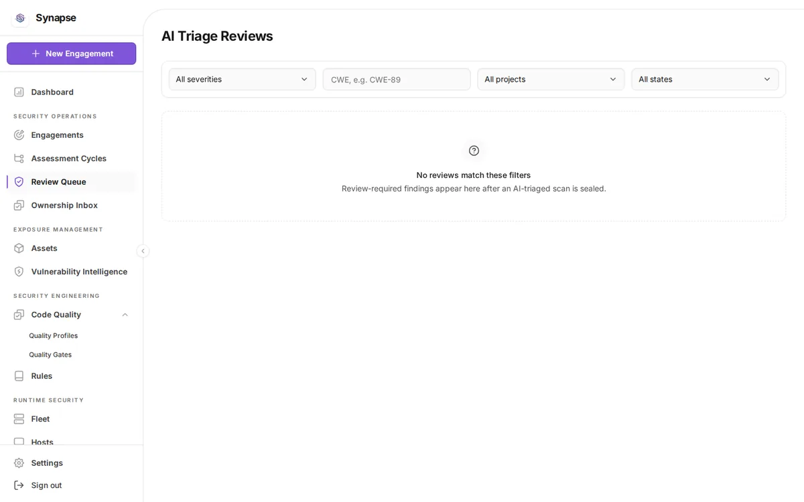

# AI triage review

[Documentation home](README.md) · Previous: [Fleet and runtime defense](fleet-blue-team.md) · Next: [Remediation SLA governance](sla-governance.md)

AI false-positive triage is optional, propose-only, and off by default. When enabled, a model proposes that
a finding is a false positive; a distinct verifier independently assesses it; and a human makes the final
call. A finding is never deleted and never leaves the report.

This guide covers the runtime review workflow. For offline datasets, comparison gates, promotion, rollback,
and drift detection, see [AI triage evaluation](ai-triage-evaluation.md).



*The review queue is the human decision boundary. This sanitized empty state was captured from a local stack and contains no findings, credentials, or customer identifiers.*

## Shadow first

```bash
SYNAPSE_FP_TRIAGE_ENABLED=true
SYNAPSE_FP_TRIAGE_MODE=shadow    # default
```

| Mode | Behavior |
| --- | --- |
| `shadow` | Records `would_gate_exempt` for observation. The finding always keeps gating |
| `enforce` | Permits the verified-consensus policy to set `gate_exempt` |

An empty or unknown mode fails closed to `shadow`. Run in shadow long enough to compare proposals against
reviewer decisions before considering `enforce`.

## Evidence-bound proposals

Before any model call, the server assembles deterministic context: source and sink, data flow, sanitizers,
call path, route and framework facts, and reachability. Each item carries a server-generated evidence-token
ID.

A model claim must cite those current token IDs. An unknown, missing, driver-incompatible, or
finding-mismatched receipt fails closed and the finding keeps gating. The model cannot invent its own
justification, because the tokens it must reference are issued by the server for that specific finding.

## Independence

```bash
SYNAPSE_VERIFIER_MODEL=...             # must differ from SYNAPSE_FP_TRIAGE_MODEL
SYNAPSE_FP_TRIAGE_INDEPENDENCE=model_family
```

| Policy | Requirement |
| --- | --- |
| `model_family` | Proposer and verifier must be different canonical model families |
| `provider` | Additionally requires different non-empty provider identities |

Provider and date aliases, plus Amazon Bedrock inference-profile IDs, are canonicalized and fail closed as
the same family, so one model cannot verify itself under two names. An unknown policy value fails closed to
advisory-only. The verifier is blind to the proposer's result.

Set a separate endpoint and credential with `SYNAPSE_VERIFIER_BASE_URL` and `SYNAPSE_VERIFIER_API_KEY` when
provider separation is required.

## Human review queue

Even with verified consensus, a human decides:

```
GET  /api/v1/ai-triage/reviews
POST /api/v1/ai-triage/reviews/{rid}/claim
POST /api/v1/ai-triage/reviews/{rid}/decision
```

A review's lifecycle is a closed three-state set:

| State | Meaning |
| --- | --- |
| `pending` | Awaiting a human reviewer |
| `accepted` | A human accepted the false-positive recommendation |
| `rejected` | A human rejected it; the finding remains in the gate |

Decisions are `accept` or `reject`, each with a rationale. A review can only be decided from `pending`;
deciding an already-decided review is a conflict rather than an overwrite. Decisions use an expected version
so two reviewers cannot silently race.

Claiming a review assigns it, so two people do not duplicate the same adjudication.

## Safety floors that AI cannot lift

Consensus is necessary but not sufficient. These floors always require human review regardless of what the
models agree on:

- High and critical severity findings
- Secret findings
- Dangerous CWE classes

A gate exemption also never removes the finding. It stays in SARIF and JSON output with an external
suppression recording the policy version and reason, so a reader can see both the exemption and its
justification.

## Budgets, cost, and circuit breakers

| Variable | Default | Purpose |
| --- | --- | --- |
| `SYNAPSE_FP_TRIAGE_MAX_FINDINGS` | bounded | Per-scan finding ceiling |
| `SYNAPSE_FP_TRIAGE_MAX_TOKENS` | bounded | Per-call output bound |
| `SYNAPSE_FP_TRIAGE_CONCURRENCY` | bounded | Parallel triage calls |
| `SYNAPSE_FP_TRIAGE_MAX_COST_MICRO_USD` | `0` | Per-scan cost ceiling; `0` disables. When enabled, every active role price must be configured or triage fails closed with no provider calls |
| `SYNAPSE_FP_TRIAGE_CIRCUIT_FAILURES` | `5` | Consecutive provider or parse failures before that role's circuit opens |
| `SYNAPSE_FP_TRIAGE_CIRCUIT_COOLDOWN` | bounded | How long an open circuit stays open |

An open circuit is advisory-only: it cannot exempt findings. Cost enforcement fails closed rather than
proceeding with unpriced calls.

Role prices are set with `SYNAPSE_FP_TRIAGE_PROPOSER_INPUT_MICRO_USD_PER_MILLION`,
`SYNAPSE_FP_TRIAGE_PROPOSER_OUTPUT_MICRO_USD_PER_MILLION`,
`SYNAPSE_FP_TRIAGE_VERIFIER_INPUT_MICRO_USD_PER_MILLION`, and
`SYNAPSE_FP_TRIAGE_VERIFIER_OUTPUT_MICRO_USD_PER_MILLION`.

## Observability

```
GET /api/v1/ai-triage/observability
```

Reports disagreement, exemption, and parse-failure rates against expected baselines set by
`SYNAPSE_FP_TRIAGE_DISAGREEMENT_BASELINE_BPS` (`1500`), `SYNAPSE_FP_TRIAGE_EXEMPTION_BASELINE_BPS`
(`1000`), and `SYNAPSE_FP_TRIAGE_PARSE_FAILURE_BASELINE_BPS` (`200`), in basis points where `10000` is
100%.

`SYNAPSE_FP_TRIAGE_ALERT_DEVIATION_BPS` and `SYNAPSE_FP_TRIAGE_ALERT_MIN_SAMPLES` control when a deviation
is worth alerting on, so a handful of samples cannot trigger a false alarm.

## Determinism and caching

Triage requests use `temperature: 0` so the same finding does not land on either side of the evidence
threshold across runs. Cached AI claims key on tenant, project or engagement scope, finding fingerprint,
complete-source hash, prompt-context hash, proposer and verifier models, prompt version, and policy
version. A cached claim is always rebound to the current finding, re-authorized by server policy, and
linked to newly sealed scan evidence. Missing tenant identity and provider failures are never cached.

## Prompt injection

The critique reads the target's own source into the prompt, so untrusted contributor code can attempt
injection through comments or strings. Distinct consensus, the human-review floors, and adversarial
invariance gates bound the risk, and the finding always remains in the report. Treat AI triage as advisory
for untrusted code.

## Automated judgment verification

When `SYNAPSE_VERIFIER_MODEL` names a distinct model, it can independently score proposed gated judgments:

```
POST /api/v1/engagements/{id}/judgments/auto-verify
```

The verifier identity is `llm:<model>` and can never be the proposer, so the self-confirmation guard holds
for machine verification exactly as it does for humans. This is best-effort; a verification failure leaves
the judgment `proposed`.

Next: [Remediation SLA governance](sla-governance.md)
